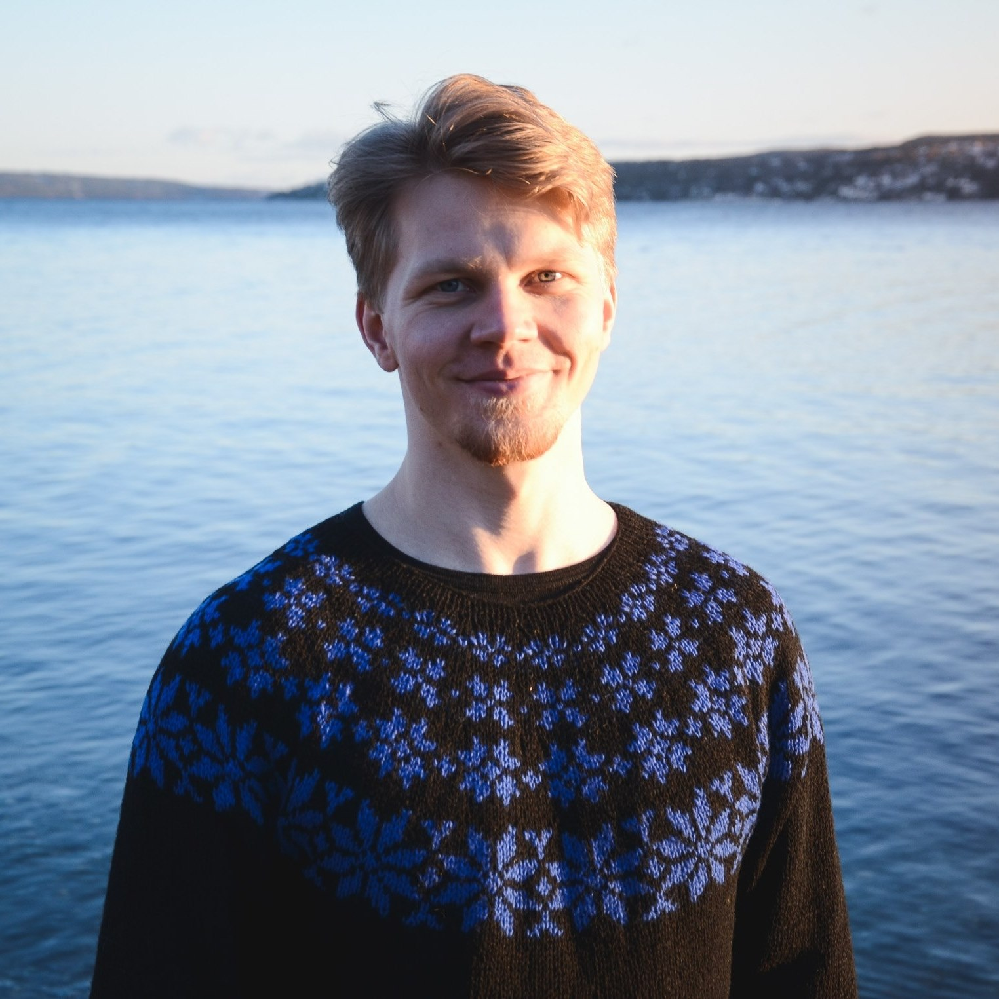

My name is Ólavur Mortensen. I'm an engineer with a background in applied mathematics and experience in machine learning, bioinformatics, and robotics. I love learning new things, and my broad background has given me the ability to learn to understand complex technologies quickly. Nature is my biggest inspiration, and I therefore aspire to contribute to a sustainable future.

